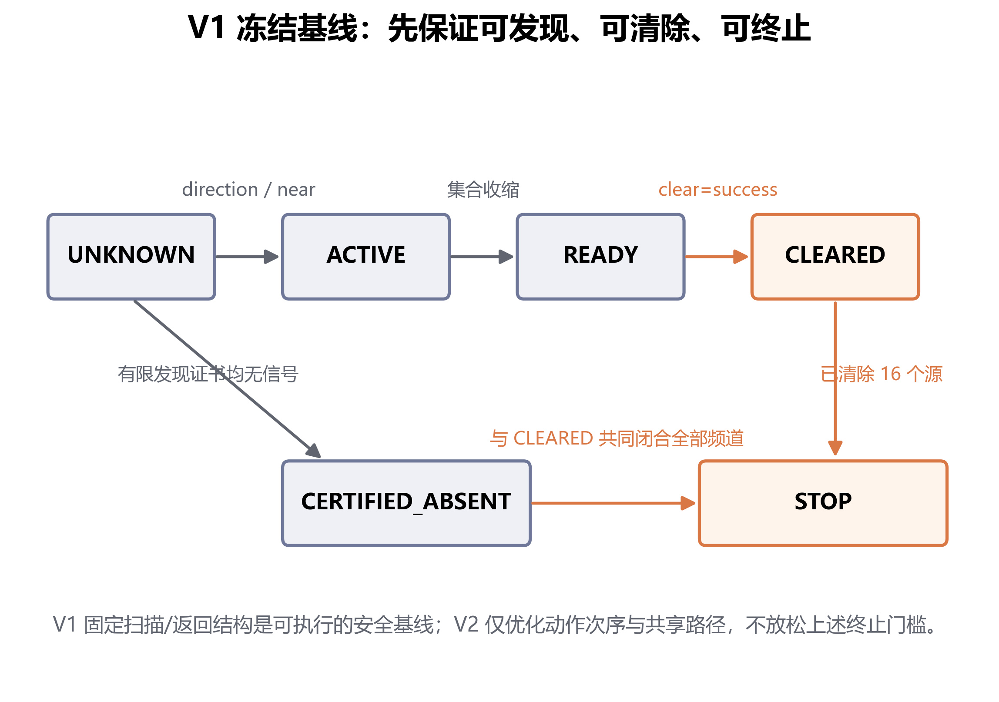
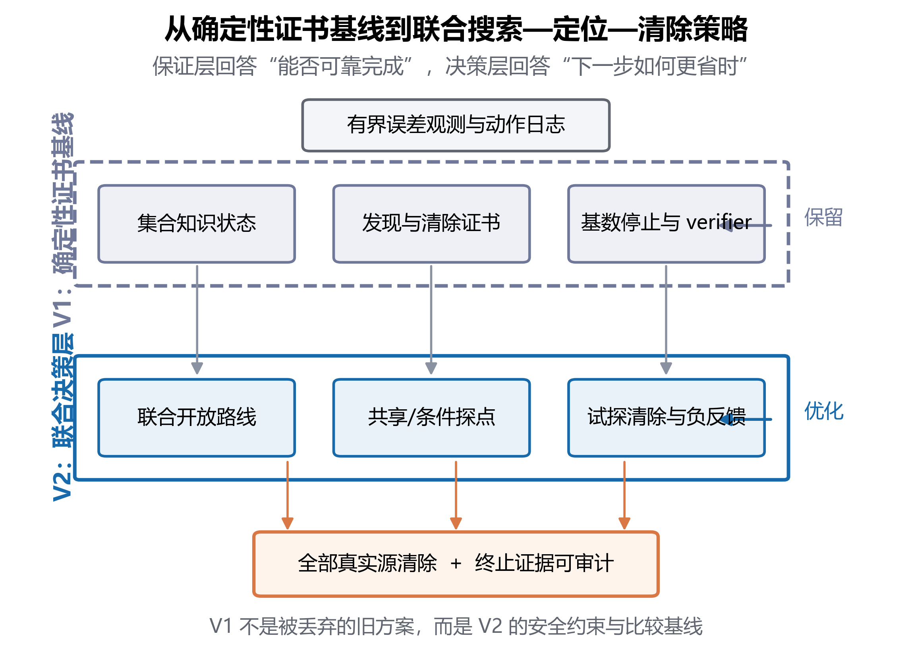
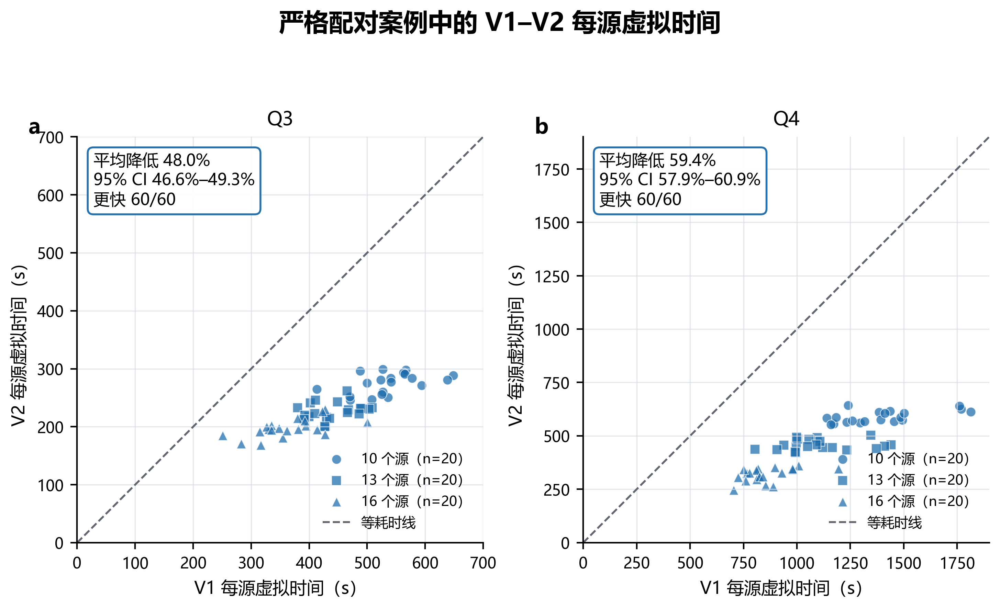
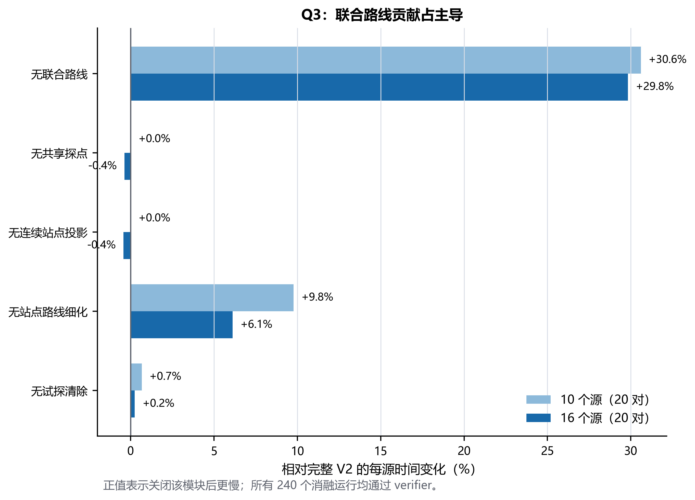
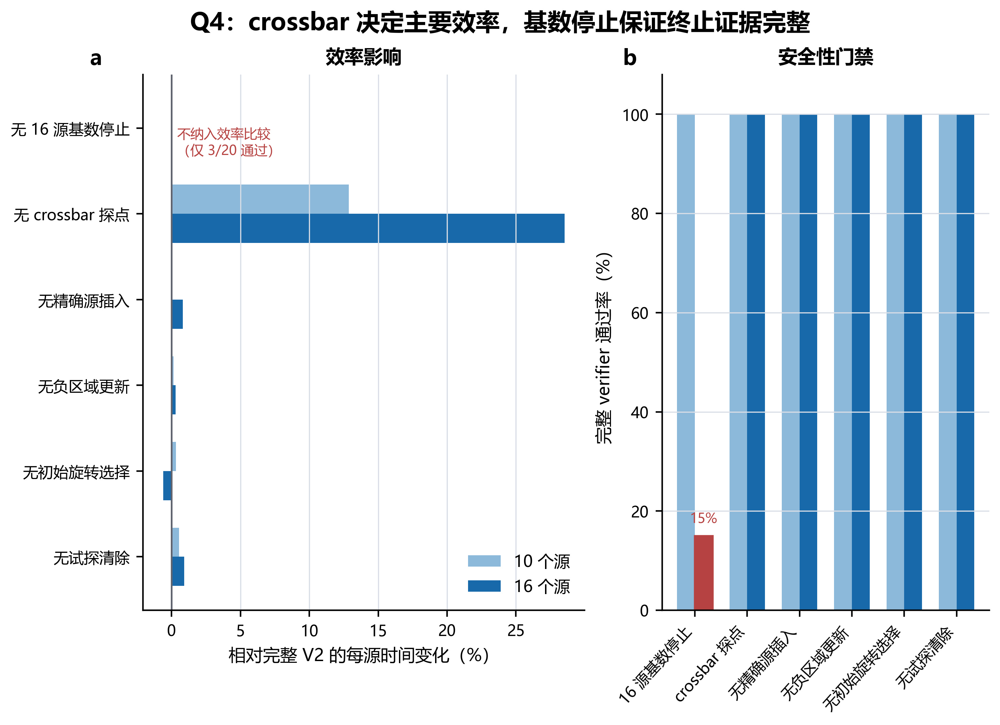
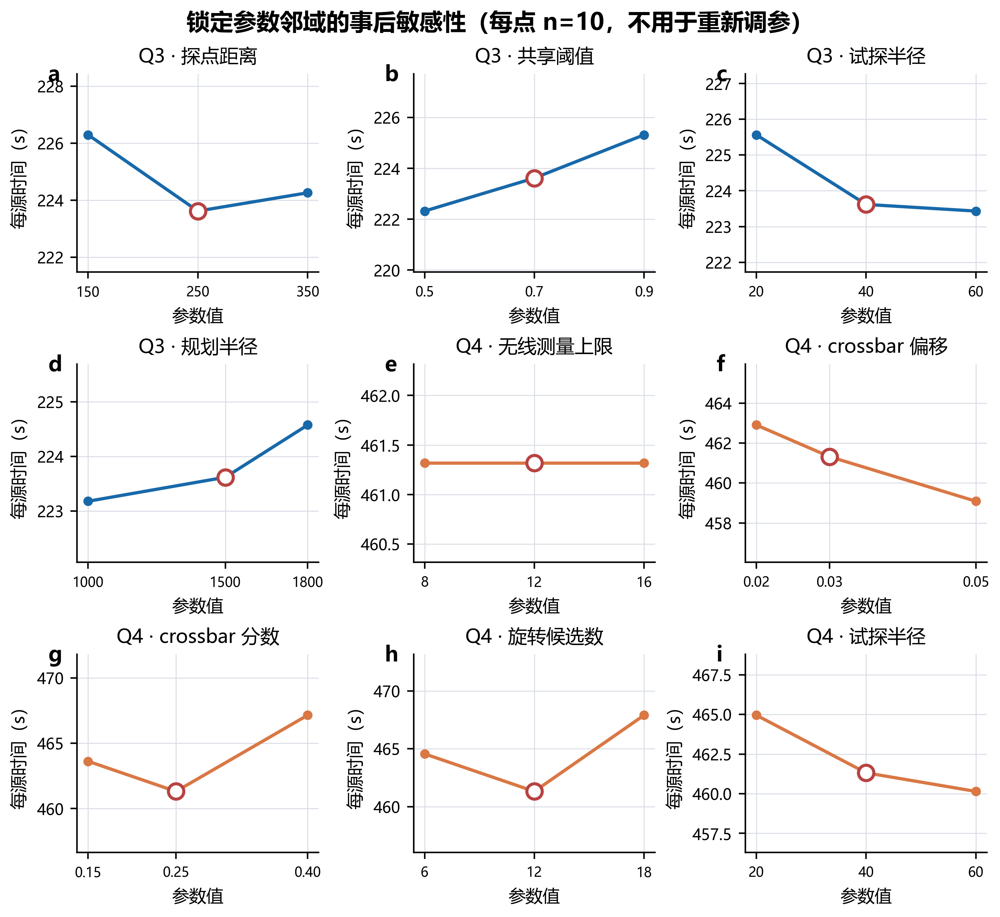
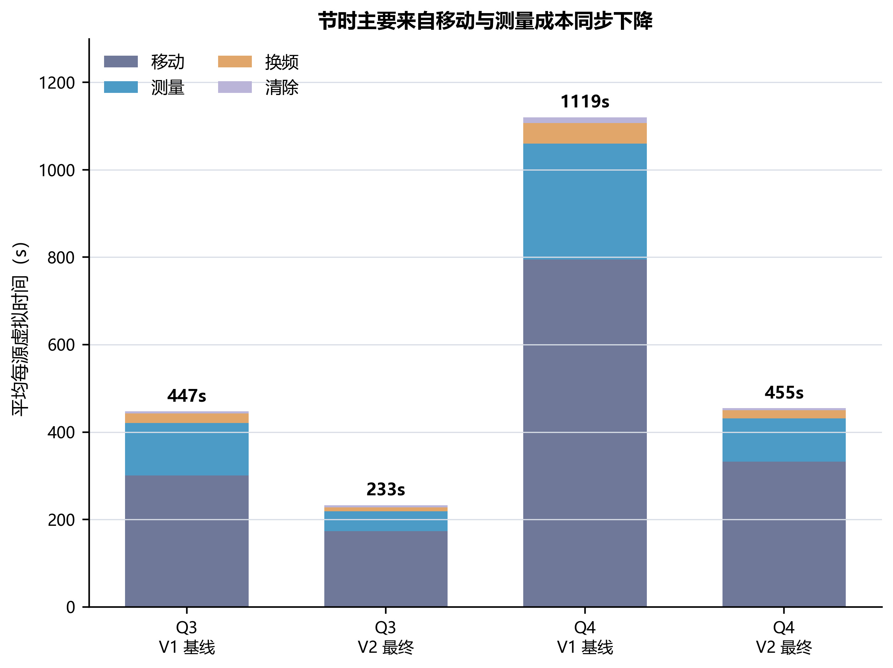
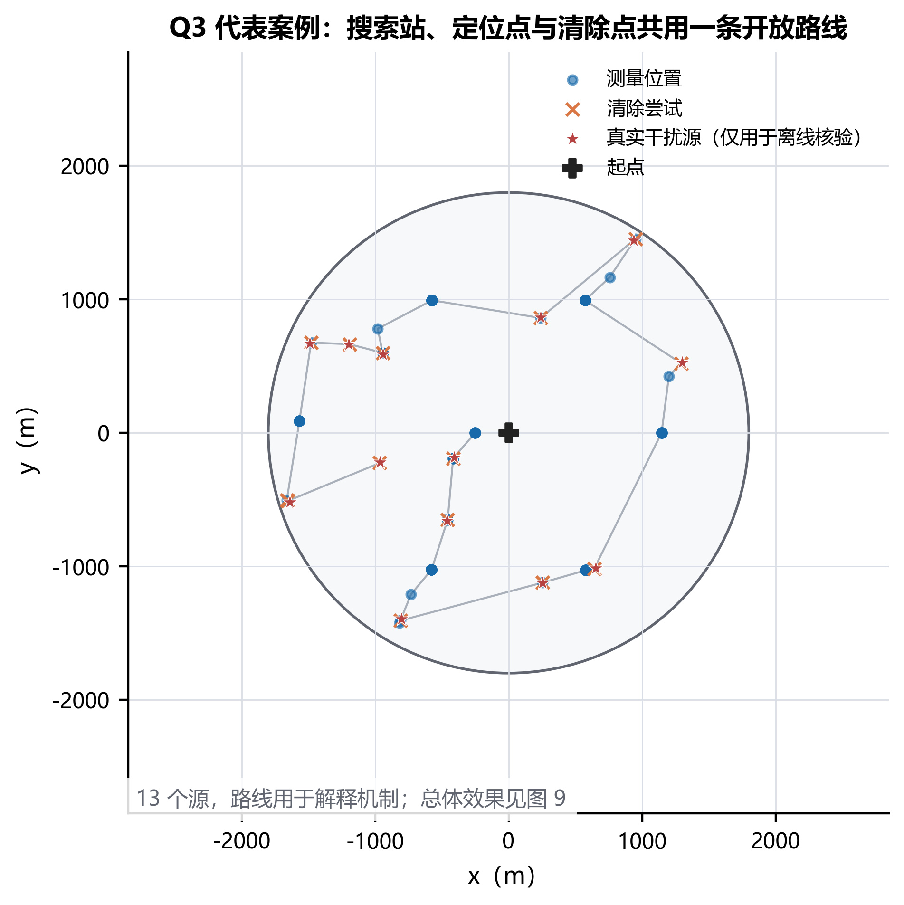
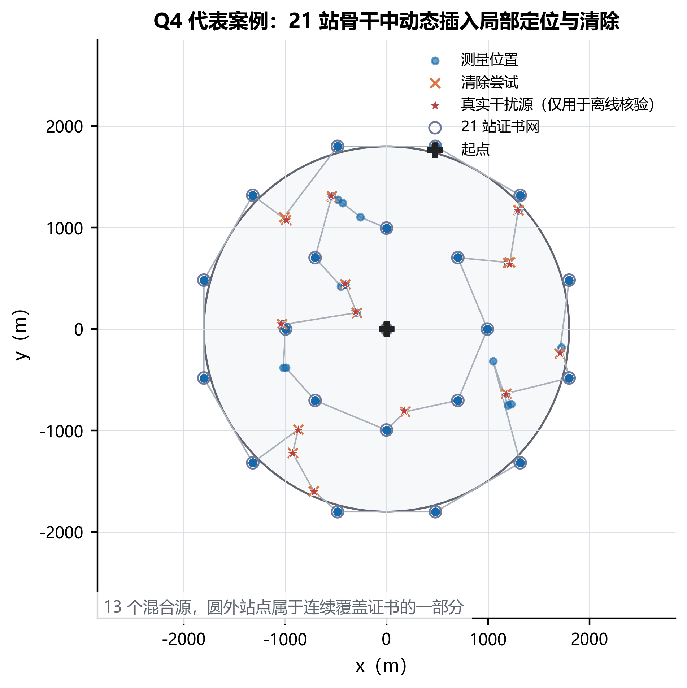

# 问题三、问题四论文替换稿（V1 保证层 + V2 决策层）

> 证据口径：`Q3_Q4_Paper_Model_Narrative_v2.0.md` 作为 V1 叙述来源；V1 可执行基线为冻结配置 `candidate_v1_FROZEN_CONFIG.yaml`；其余 `q3+q4_v2` 代码和产物为 V2，最终求解器分别为 `q3_joint_search_clear_route_v5` 与 `q4_21station_exact_route_v4`。所有经验结论仅用于本次共同合成案例，不外推为全局最优结论。

## 摘要中问题三、问题四的替换文字

针对问题三和问题四，本文先以集合知识状态、有限发现/清除证书和基数停止规则构造可执行的 V1 基线，再在不放松完整 verifier 的条件下建立 V2 联合搜索—定位—清除策略。V2 将固定扫描、局部定位与清除动作统一为从当前位置出发的开放路线，并利用搜索站共享测量、连续站点投影、条件探点、试探清除和负反馈更新减少往返。问题四针对定向源另构造“中心点 + 8 点内环 + 12 点外环”的 21 站连续覆盖证书，并由 crossbar 双侧探点处理无信号的方向歧义。对源数为 10、13、16 的 120 个共同案例进行严格配对比较，两问共 240 次主运行均清除全部真实源、通过独立 verifier 且计时账本闭合。相对 V1，V2 在问题三和问题四中的平均每源虚拟时间分别降低 48.0%（95% bootstrap CI：46.6%～49.3%）和 59.4%（57.9%～60.9%），两问均在 60/60 个配对案例中更快。消融表明，问题三的主要节时来自联合路线，问题四的主要节时来自 crossbar 条件探点；去除 16 源基数停止后，问题四 16 源案例仅 3/20 通过完整 verifier，说明该规则属于安全终止条件而非可随意删去的效率模块。

关键词建议补充：集合知识状态；确定性证书；联合开放路线；配对实验；消融分析

## 问题分析替换文字

### 问题三

问题三不仅要求定位单个全向源，还要求在源数未知、频道未知和动作代价并存的条件下完成全部搜索与清除。困难可分为两个层面：一是如何证明真实源不会被遗漏、无源频道不会被误判以及任务能够有限终止；二是在这些保证成立后，如何减少固定扫描、返回锚点和重复测量造成的时间。为此本文将两层问题分开处理：V1 负责可发现、可清除、可终止的保证性基线，V2 在完全继承其状态门禁和核验标准的基础上重排动作，把搜索、定位和清除纳入一条开放路线。这样既保留可审计的完成依据，又能用严格配对实验衡量决策层优化的净收益。

### 问题四

问题四引入定向源后，测点返回 `no_signal` 既可能表示频道不存在，也可能表示测点位于发射半平面之外。因此，问题三的全向圆盘证空逻辑不能直接用于问题四。本文仍以 V1 的集合状态与终止门禁作为安全边界，但将最终发现结构替换为经连续几何核验的 21 站证书网，并在局部服务阶段加入 crossbar 双侧条件探点、负区域更新和精确源插入。问题四的核心不再是“多扫几个点”，而是使每个无信号动作都具有明确含义，并让发现骨干和已发现源的定位、清除共同参与路线决策。

## 问题三模型建立与求解

### 保证性状态与 V1 冻结基线

对频道 \(c\) 定义知识状态

\[
K_c=(P_c,E_c,O_c,s_c),\qquad
s_c\in\{\text{UNKNOWN, ACTIVE, READY, CLEARED, CERTIFIED\_ABSENT}\},
\]

其中 \(P_c\) 是由有界测向角域和接收约束得到的位置可行集，\(E_c\) 为已证空域，\(O_c\) 保存原始观测与清除反馈。`direction` 使频道进入 ACTIVE，`near` 或可行集已落入 20 m 清除圆时进入 READY，清除成功后进入 CLEARED；只有有限发现证书闭合或由源数上界推出时，频道才可进入 CERTIFIED_ABSENT。任务只在“已清除 16 个不同频道”或“20 个频道均为 CLEARED/CERTIFIED_ABSENT”时结束，清除 10 个源不是停止条件。

V1 采用固定发现点、返回结构和逐频道服务，是满足上述门禁的冻结可执行基线。它回答的是“在硬误差边界下能否可靠完成”，而不是“平均时间是否最短”。V1 的价值因此有两点：一是为 V2 提供不能放松的状态、证书与停止约束；二是为同案例、同种子、同计时规则下的效率比较提供基线。图 7 给出其状态闭环。

图 7  V1 冻结基线的知识状态、有限证书与停止规则

### V2：联合搜索—定位—清除路线

设当前位置为 \(x_0\)，当前仍需执行的任务集合为

\[
\mathcal T=\mathcal T_{\rm scan}\cup\mathcal T_{\rm loc}\cup\mathcal T_{\rm clear}.
\]

每个任务 \(i\) 具有候选位置 \(x_i\)、动作耗时 \(\tau_i\) 和可共享的频道集合 \(C_i\)。V2 不再依次完成“全域扫描—返回—逐源定位”，而是在每次重规划时求从 \(x_0\) 出发、不要求返回起点的开放路线 \(\pi\)，其评价函数为

\[
J(\pi)=\frac{1}{v}\sum_{k=0}^{m-1}\|x_{\pi_{k+1}}-x_{\pi_k}\|_2
+\sum_{k=1}^{m}\tau_{\pi_k}+J_{\rm residual}(\pi),
\]

其中 \(v\) 为移动速度，\(J_{\rm residual}\) 表示路线结束后尚未闭合的发现与定位任务的保守代价。算法只在候选动作已经由 V1 保证层判为合法时比较 \(J\)，因此路线缩短不会改变“是否完成”的判据。

Q3 最终策略 `q3_joint_search_clear_route_v5` 使用联合路线、250 m 探点距离、0.7 的搜索站共享阈值、40 m 试探清除半径和 1500 m 规划半径。对已发现频道，算法把局部定位点投影到当前开放路线附近，并进行一次站点次序细化；当搜索站对某 ACTIVE 频道同时具有足够几何信息时，在同一停点完成共享测量；可行集半径进入 40 m 邻域后允许一次可核验的试探清除，失败反馈继续收缩可行域。共享测量和试探清除都是条件动作，没有触发时不改变主线。代表案例见图 14。

图 8 概括 V1 与 V2 的关系：V1 的集合状态、证书和停止规则全部保留，V2 只升级联合路线、条件探点与局部清除决策。二者不是互斥版本，而是“保证层继承、决策层升级”。

图 8  从 V1 确定性证书基线到 V2 联合决策层

### 算法流程

1. 在原点完成当前频道测量，更新 \(K_c\)，并建立未完成的扫描、定位和清除任务池。
2. 删除已经 CLEARED 或具有有效 CERTIFIED_ABSENT 证据的任务；检查 16 源基数停止与 20 频道闭合条件。
3. 对合法候选点计算移动、测量、换频和清除成本，并把可在同一位置完成的多频道测量合并。
4. 构造从当前位置出发的联合开放路线，对局部定位点执行连续投影和一次次序细化。
5. 执行路线首个动作；根据 `direction`、`near`、`no_signal` 或清除反馈更新集合状态，再回到步骤 2。
6. 结束后由独立 verifier 复核真实源清除、证空依据、停止条件和虚拟时间账本；任一项失败均不计为可接受运行。

该流程的保证性来自 V1 门禁：V2 只改变合法动作的顺序与共享方式，不会把未观测点当成证据，也不会用清除失败或不完整扫描直接宣布频道不存在。图 14 中真实源位置只用于离线解释，不参与在线决策。

### 配对实验设计与结果

为避免不同随机场景造成伪比较，V1 与 V2 使用完全相同的案例文件、源位置、半径、频道、种子和计时规则。Q3 在 10、13、16 个源三种规模上各取 20 个案例，共 60 对。主指标为每源虚拟时间

\[
t_{\rm src}=T_{\rm virtual}/N_{\rm source},
\]

并对每个案例计算相对降幅 \((t_{V1}-t_{V2})/t_{V1}\)。置信区间以案例为重采样单位，固定种子 20260913，进行 10000 次 percentile bootstrap。只有完成全部真实源清除、通过 verifier 且计时账本闭合的运行进入效率统计。

| 源数 | 案例对数 | V1 每源时间/s | V2 每源时间/s | 平均降幅 | V2 更快 |
|---:|---:|---:|---:|---:|---:|
| 10 | 20 | 536.11 | 274.73 | 48.8% | 20/20 |
| 13 | 20 | 441.54 | 226.54 | 48.7% | 20/20 |
| 16 | 20 | 364.83 | 197.23 | 45.9% | 20/20 |

60 对案例中，V1 和 V2 的平均每源时间分别为 447.49 s 和 232.83 s。V2 的平均降幅为 48.0%，95% bootstrap CI 为 46.6%～49.3%，且 60/60 个案例均更快。图 9a 给出的逐例散点全部位于等耗时线下方，说明总体均值并非由少量极端案例驱动。

图 9  严格配对案例中的 V1–V2 每源虚拟时间

### Q3 消融与敏感性

消融实验在 10 源和 16 源案例上各使用 20 个共同案例。去除联合路线后，每源时间分别上升 30.6% 和 29.8%，是 Q3 最主要的效率来源；去除站点路线细化后分别上升 9.8% 和 6.1%。共享探点、连续站点投影和试探清除在该组案例中的平均影响接近零至 1%，因此只能表述为条件性补充，不能声称它们稳定带来显著收益。全部 240 次 Q3 消融运行均通过 verifier。

图 10  Q3 模块消融的配对每源时间变化

锁定参数邻域的事后敏感性分析显示：探点距离 150/250/350 m 时平均每源时间为 226.3/223.6/224.3 s，共享阈值 0.5/0.7/0.9 时为 222.3/223.6/225.3 s，试探半径 20/40/60 m 时为 225.6/223.6/223.4 s，规划半径 1000/1500/1800 m 时为 223.2/223.6/224.6 s。0.7 并非这批事后案例上的经验最优点；参数在主实验前已锁定，敏感性结果不用于重新调参。

## 问题四模型建立与求解

### 定向源观测与 21 站连续覆盖证书

定向源的物理状态写为 \((p,r,u)\)，其中 \(p\) 为位置，\(r\) 为接收半径，\(u\) 为发射朝向单位向量。测点 \(x\) 可收到信号需同时满足

\[
\|x-p\|_2\le r,\qquad u^\top(x-p)\ge0.
\]

因此单点 `no_signal` 不能直接推出频道不存在。Q4 最终策略用 21 个证书站点构成发现骨干：中心 1 点、半径 995 m 的 8 点内环和半径 1864 m 的 12 点外环。程序对连续目标域而非有限随机样本执行覆盖核验；整张站网的刚性旋转不改变覆盖证书。原点首次观测后，若已有已发现源，算法在 \([0,\pi/2)\) 内比较 12 个刚性旋转候选，选择预测开放路线最短者；该选择只依赖已获得观测和任务几何，不读取真实源数或真实位置。

若某频道在全部必要站点均无信号，才能标记为 CERTIFIED_ABSENT；否则保留 UNKNOWN 或 ACTIVE。外环部分站点位于 1800 m 目标圆外，这是连续覆盖构造的一部分，而不是越界的真实源位置。代表案例的 21 站骨干和实际路线见图 15。

### crossbar 条件探点与负反馈更新

对已获得方向观测的频道，设当前可行多边形为 \(P\)，参考测点为 \(s\)，读数方向为 \(a\)，令

\[
u=(\cos a,\sin a)^\top,\qquad v=(-\sin a,\cos a)^\top.
\]

在 \(P\) 沿 \(u\) 的中截面两侧构造

\[
x_{\pm}=s+d u\pm h v,
\]

其中 \(d\) 取投影区间中点，\(h\) 由测向误差宽度与 `crossbar_offset=0.03` 共同确定，并在执行前验证两点到当前可行域顶点的最远距离不超过接收保证。若两侧均为 `no_signal`，即可用相应截面约束收缩可行域；只要任一点获得正观测，就转入常规定位或清除。该“双侧暗”条件把方向歧义变为可验证的几何切割，而不是把一次无信号误当作不存在证据。

Q4 还使用半径 40 m 的试探清除、每频道最多 12 次无线测量、基于失败清除圆盘的负区域更新，以及源任务对 21 站骨干的精确插入。联合路线的目标函数与 Q3 相同，但任务池额外包含证书站点和 crossbar 点。已发现源的局部动作只改变路线次序，CERTIFIED_ABSENT 与全局停止仍由完整证书和基数规则决定。

### 配对结果

Q4 使用 mixed 场景，仍在 10、13、16 个源三种规模上各取 20 个共同案例。所有 V1/V2 运行均使用相同场景与计时规则。

| 源数 | 案例对数 | V1 每源时间/s | V2 每源时间/s | 平均降幅 | V2 更快 |
|---:|---:|---:|---:|---:|---:|
| 10 | 20 | 1395.09 | 590.35 | 57.7% | 20/20 |
| 13 | 20 | 1106.08 | 456.94 | 58.7% | 20/20 |
| 16 | 20 | 857.16 | 317.54 | 63.0% | 20/20 |

60 对案例中，V1 和 V2 的平均每源时间分别为 1119.44 s 和 454.95 s；平均降幅为 59.4%，95% bootstrap CI 为 57.9%～60.9%，60/60 个案例中 V2 均更快。Q3、Q4 的逐例配对结果统一列于图 9。

### Q4 消融、安全门禁与敏感性

去除 crossbar 后，10 源和 16 源案例的每源时间分别上升 12.9% 和 28.5%，说明它是 Q4 的主要效率模块。去除精确源插入、负区域更新、初始旋转选择或试探清除时，平均变化均不超过 1%，这些模块在本组案例中只得到“条件性或次要贡献”的证据。安全性负对照更为关键：去除“发现/清除 16 源后停止”规则时，10 源案例仍 20/20 通过，但 16 源案例只有 3/20 通过完整 verifier；其余 17 例虽已清除全部 16 个真实源，却留下无法证空的频道。因此这 17 例不进入效率比较，不能把不完整终止产生的低时间当作改进。

图 11  Q4 模块消融及 16 源基数停止的安全性负对照

Q4 的事后敏感性结果为：无线测量上限 8/12/16 时均为 461.3 s/源；crossbar 偏移 0.02/0.03/0.05 时为 462.9/461.3/459.1 s/源；crossbar 分数 0.15/0.25/0.40 时为 463.6/461.3/467.2 s/源；初始旋转候选数 6/12/18 时为 464.6/461.3/467.9 s/源；试探半径 20/40/60 m 时为 465.0/461.3/460.1 s/源。所有点均通过 verifier。图 12 的作用是检查锁定参数附近是否出现灾难性敏感，而不是用同一批数据重新选参数。

图 12  锁定参数邻域的事后敏感性分析

### 时间构成与解释边界

图 13 将 60 个案例的平均每源虚拟时间分解为移动、测量、换频和清除。V2 的节时不是删减验证动作所得：两问 240/240 次主运行均通过完整门禁。主要下降来自移动与测量成本同步减少，与“将扫描和局部服务放到同一开放路线”的机制一致；清除成本只占较小部分。

图 13  V1 与 V2 平均每源虚拟时间的成本分解

### 代表路线与机制解释

代表案例只用于解释动作怎样被合并，不替代总体统计。Q3 中，搜索站、定位点和清除点共用一条开放路线；Q4 中，局部定位与清除任务插入 21 站证书骨干。图中的真实源均只用于离线核验。

图 14  Q3 代表案例中搜索站、定位点和清除点的联合开放路线

图 15  Q4 代表案例中 21 站证书骨干与局部定位、清除动作的动态插入

## 模型检验与评价中的替换文字

### 正确性与可复现性

主实验包含两问各 60 个共同案例、每案例两个策略，共 240 次运行；每次运行均保存案例哈希、代码哈希、参数指纹、动作日志、ground truth、引擎结果、计时指标与 verifier 报告。接受门槛同时要求：求解正常结束、真实源全部清除、世界状态一致、完整 verifier 通过、源代码运行前后哈希一致、虚拟时间账本闭合。240/240 次主运行满足全部条件。V1 与 V2 共享案例文件和计时规则，避免以不同随机场景代替配对比较。

### 结论边界

本文证明或核验的是有限证书、状态门禁和所运行案例上的完整性，不证明 V2 对所有场景全局最优。95% bootstrap 区间反映当前案例总体中的配对变异，不是确定性最坏情形界。敏感性实验是锁参后的邻域检查；即使某个邻近值在 10 个事后案例上略好，也不据此改写冻结参数。对消融中不通过 verifier 的运行只报告安全性通过率，不报告其条件耗时为“性能提升”。

### 模型优点

1. V1 和 V2 的角色清楚：V1 提供可执行保证层与公平基线，V2 仅在相同门禁下优化决策，避免把“换一个方案”误写成“证明更强”。
2. 实验采用严格配对、源数分层、bootstrap 区间和逐例胜负统计，并保留动作级证据，结论可追溯。
3. 消融同时报告效率和安全性；Q4 基数停止的失败负对照表明 verifier 门槛确实能够阻止伪优势。
4. 代表路线、总体散点、消融、敏感性和成本分解分别承担机制解释与统计证据，避免用单个案例代替总体结论。

### 模型局限

1. 当前经验结论来自合成随机/混合案例，官方隐藏分布未确认，不能外推为所有实例上的最优性。
2. Q3 的共享探点、连续站点投影与试探清除在本实验中的边际效应较小；保留它们是因为其条件触发成本有限，而非因为已证明稳定节时。
3. Q4 的 21 站网络是通过连续覆盖核验的充分构造，不声称站点数最少；外环站点可位于目标圆外，若实际平台限制测点范围，需要重新设计并重新认证。
4. 旧 V1 测试集有 4 个失败项，均来自已迁移的旧绘图脚本/路径缺失；334 个算法与验证测试通过。本文的新 JPG 图件由独立证据流水线生成，不把旧图件测试失败解释为算法失败，但在最终交付记录中保留这一已知限制。
